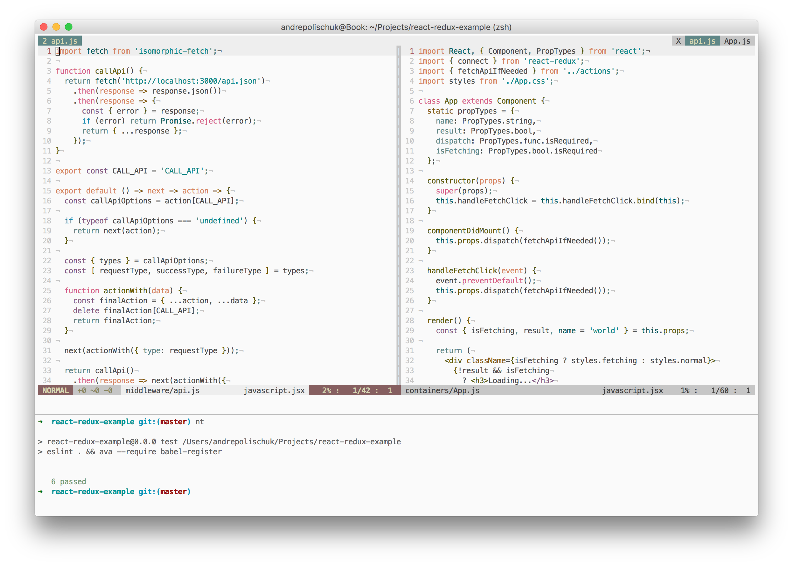

# dotfiles

> Dotfiles for shell, zsh, vim, macOS, etc



## Install

```sh
# dotfiles
git clone https://github.com/andrepolischuk/dotfiles && ~/dotfiles/init.sh

# git config
git config --global user.name "Your Name"
git config --global user.email "email@yoursite.com"
```

You may set macOS defaults:

```sh
~/dotfiles/macos.sh
```

## Apps

* [Hyper][hyper]
* [zsh][zsh]
* [oh-my-zsh][oh-my-zsh]
* [git][git]
* [vim][vim]
* [min zsh prompt][min]

## Thanks to...

* [Anton Shuvalov][a] and his [dotfiles][a-dotfiles] inspired me to create the same
* [Denys Dovhan][denysdovhan] and his [dotfiles][denysdovhan-dotfiles]
* [Mathias Bynens][mathiasbynens] and his [dotfiles][mathiasbynens-dotfiles] with macOS defaults

## License

MIT

[hyper]: https://hyper.is
[zsh]: http://www.zsh.org
[oh-my-zsh]: https://github.com/robbyrussell/oh-my-zsh
[git]: https://git-scm.com
[vim]: http://www.vim.org
[min]: https://github.com/andrepolischuk/min

[a]: https://github.com/A
[a-dotfiles]: https://github/A/.dotfiles

[denysdovhan]: https://github.com/denysdovhan
[denysdovhan-dotfiles]: https://github.com/denysdovhan/dotfiles

[mathiasbynens]: https://github.com/mathiasbynens
[mathiasbynens-dotfiles]: https://github.com/mathiasbynens/dotfiles
