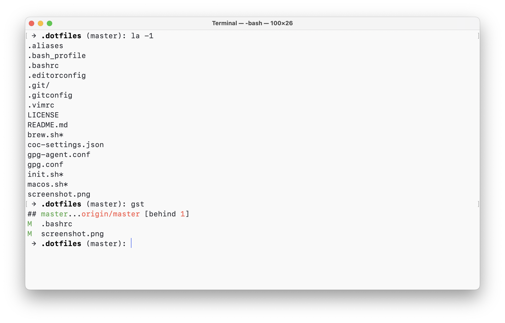

# dotfiles

> Dotfiles for bash, vim, macOS, etc



## Install

```sh
# dotfiles
git clone https://github.com/andrepolischuk/dotfiles && cd dotfiles && ./init.sh

# git config
git config --global user.name "Your Name"
git config --global user.email "email@yoursite.com"
```

You may install Homebrew formulae:

```sh
./brew.sh
```

And set some macOS defaults:

```sh
./macos.sh
```

## Thanks to...

* [Anton Shuvalov](https://github.com/A) and his [dotfiles](https://github.com/A/.dotfiles) inspired me to create the same
* [Denys Dovhan](https://github.com/denysdovhan) and his [dotfiles](https://github.com/denysdovhan/dotfiles)
* [Mathias Bynens](https://github.com/mathiasbynens) and his [dotfiles](https://github.com/mathiasbynens/dotfiles) with macOS defaults

## License

MIT
